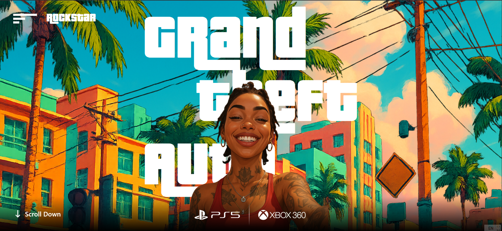
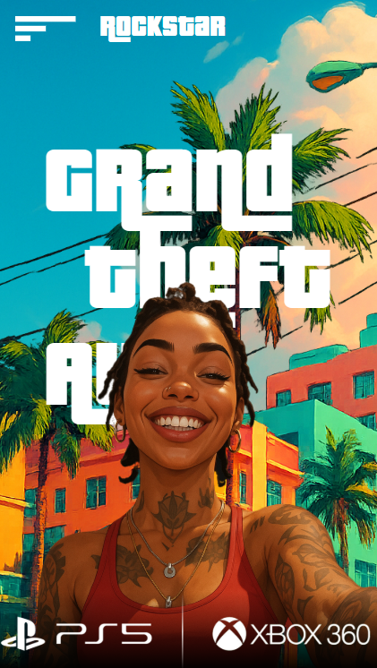

# GTA VI Website



This repository contains the source code for a GTA VI-themed website featuring animations and parallax effects, built using React.js, GSAP, and Tailwind CSS.

## Table of Contents

- [Introduction](#introduction)
- [Getting Started](#getting-started)
- [Features](#features)

## Introduction

Explore the GTA VI website, showcasing stunning animations and immersive parallax effects. Built with modern web technologies, this project is perfect for learning or inspiration.

## Getting Started

To run the project locally, follow these steps:

1. Clone this repository:
   ```bash
   git clone https://github.com/rockmel03/GTA-VI.git
   ```
2. Navigate to the project directory:
   ```bash
   cd GTA-VI
   ```
3. Install dependencies:
   ```bash
   npm install
   ```
4. Start the development server:
   ```bash
   npm run dev
   ```
5. Open your browser and visit `http://localhost:5173` to view the website.

## Features

- Smooth animations powered by GSAP
- Parallax effects on mouse movement on the homepage
- Responsive design with Tailwind CSS
- Built with React.js and Vite for fast development and performance

## Credits

This project was inspired by a tutorial from [Sheryians Coding School](https://www.youtube.com/@sheryians). Special thanks for the guidance and insights provided in the video.
